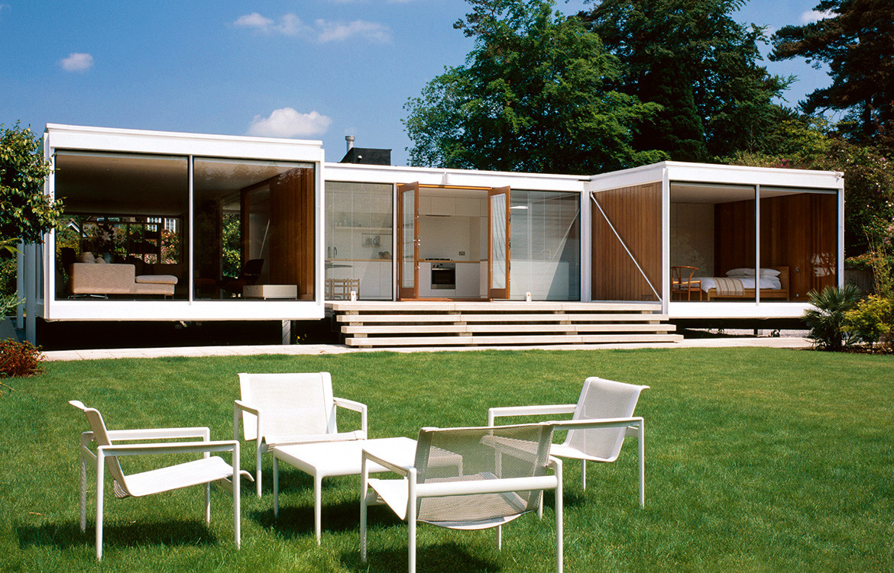

# Modern Styles Based on the Image



## Overview

The house in the image is strongly associated with **20th-century
architectural Modernism**, especially **Mid-Century Modernism**, with
characteristics of the **International Style, Bauhaus, and
Functionalism**.

The major visual principles are:

-   Simplicity
-   Functionality
-   Geometric forms
-   Horizontal lines
-   Large areas of glass
-   Minimal ornamentation
-   Natural materials
-   Indoor-outdoor connection
-   Integration with the landscape

The architecture gets much of its visual character from its
**proportions, structure, materials, light, and relationship to
nature**, rather than decorative details.

------------------------------------------------------------------------

## 1. Mid-Century Modernism

The strongest classification for the house is **Mid-Century Modern**.

Typical characteristics visible here include:

-   Low horizontal profile
-   Flat or very low-pitched roof forms
-   Large windows
-   Floor-to-ceiling glass
-   Open interior spaces
-   Rectangular building volumes
-   Minimal decoration
-   Natural wood
-   Strong connection to the landscape

The house appears to be made from several rectangular sections rather
than one traditional enclosed mass. This makes the building feel spread
across the landscape.

### Key idea

> **Modern living should be simple, functional, and connected to
> nature.**

------------------------------------------------------------------------

## 2. International Style

The image also contains characteristics associated with the
**International Style**.

The style emphasizes:

-   Geometric forms
-   Rectangular volumes
-   Horizontal and vertical lines
-   Flat roofs
-   Large expanses of glass
-   Minimal ornament
-   Functional planning

The building communicates through a simple visual vocabulary:

> **Rectangle + glass + structure + open space**

There are few historical or decorative references. The form is allowed
to communicate the function of the building.

------------------------------------------------------------------------

## 3. Bauhaus Influence

The design also reflects principles associated with the **Bauhaus**,
particularly the relationship between design and function.

A central Modernist idea is:

> **Form follows function.**

In the image:

-   Large windows provide natural light and views.
-   Openings connect interior spaces with the outdoors.
-   Simple structural forms reduce unnecessary decoration.
-   The organization of the rooms contributes to the appearance of the
    building.

The architecture itself becomes the decoration.

------------------------------------------------------------------------

## 4. Functionalism

**Functionalism** argues that design should respond primarily to its
intended purpose.

The house appears organized around:

-   Movement through the building
-   Natural light
-   Views
-   Outdoor access
-   Flexible living spaces
-   Efficient structural forms

A useful description is:

> **Every major visual element has a purpose.**

------------------------------------------------------------------------

## 5. Indoor-Outdoor Integration

One of the most important characteristics is the relationship between
the house and its surroundings.

The extensive glass openings reduce the visual boundary between:

**House → Patio → Lawn → Trees**

The landscape becomes part of the architectural experience.

This is a major characteristic of Mid-Century Modern residential design.

------------------------------------------------------------------------

## 6. Horizontal Emphasis

The house has a strong **horizontal orientation**.

The rooflines, windows, steps, and building sections move primarily from
left to right.

This creates a feeling of:

-   Calm
-   Stability
-   Openness
-   Connection to the ground

The horizontal house also contrasts with the vertical trees behind it,
creating a strong visual composition.

------------------------------------------------------------------------

## 7. Geometric Simplicity

The building is visually constructed from simple shapes:

-   Rectangles
-   Horizontal planes
-   Vertical supports
-   Glass panels
-   Repeated structural divisions

There are very few decorative forms.

The result is an architecture that communicates quickly and clearly.

> **What you see is largely what the building is.**

------------------------------------------------------------------------

## 8. Materials

The image combines industrial and natural materials.

### Glass

Creates transparency, natural light, and visual connection to the
landscape.

### Wood

Adds warmth and contrasts with the glass and white structural elements.

### White structural surfaces

Create a clean and bright appearance.

### Concrete or masonry

Provides a heavier visual base for the lighter upper structure.

### Metal

Contributes to the precise, engineered appearance of the thin frames and
supports.

The overall material strategy can be summarized as:

> **Industrial materials + natural materials**

------------------------------------------------------------------------

## 9. Minimal Ornamentation

The building does not rely on:

-   Decorative columns
-   Elaborate moldings
-   Historical ornament
-   Ornamental roof details
-   Complex facade patterns

Instead, visual interest comes from:

-   Proportion
-   Materials
-   Geometry
-   Light
-   Landscape
-   Structure

This is one of the fundamental characteristics of Modernist
architecture.

------------------------------------------------------------------------

## 10. Open Plan

The interior appears visually open rather than divided into many small
enclosed rooms.

The large openings and interconnected sections create visual continuity.

This reflects the Modernist movement toward:

-   Flexible spaces
-   Fewer walls
-   Shared living areas
-   Visual continuity
-   Multi-purpose rooms

The goal is to make the interior feel larger and more connected.

------------------------------------------------------------------------

## 11. Nature as Part of the Design

Nature is not merely decoration around the house.

The building is deliberately integrated with:

-   Grass
-   Trees
-   Plants
-   Sunlight
-   Open space

Large windows frame the surrounding landscape.

This reflects a major Modernist residential principle:

> **Architecture should respond to its environment rather than isolate
> itself from it.**

------------------------------------------------------------------------

## 12. Light

Natural light is an important design element.

The extensive glazing allows daylight to enter deeply into the interior.

Modernist architecture often treats light almost like another building
material.

Instead of adding decorative elements to create visual interest, the
architect can use:

-   Light
-   Shadow
-   Reflection
-   Transparency
-   Proportion

to create the experience.

------------------------------------------------------------------------

## 13. Modernism vs. Postmodernism

The image is useful for distinguishing **Modernism** from
**Postmodernism**.

### Modernism

The house emphasizes:

-   Simplicity
-   Function
-   Geometry
-   Rationality
-   Minimal ornament
-   Honest materials
-   Consistency
-   Efficiency
-   Connection to nature

### Postmodernism

Postmodern architecture often became more comfortable with:

-   Historical references
-   Irony
-   Decorative elements
-   Mixed styles
-   Visual contradiction
-   Playfulness
-   Symbolic forms

The house in the image is much closer to Modernism because its design is
based on **reduction, function, and visual clarity**.

------------------------------------------------------------------------

## 14. Overall Style Classification

  Style                          Relationship to Image
  ------------------------------ -----------------------------
  **Modernism**                  Strong
  **Mid-Century Modern**         Very strong
  **International Style**        Strong influence
  **Functionalism**              Strong
  **Bauhaus principles**         Strong conceptual influence
  **Postmodernism**              Limited
  **Traditional architecture**   Limited

### Overall description

> **Mid-Century Modern architecture rooted in broader Modernist and
> Functionalist principles, with International Style and Bauhaus
> influences.**

------------------------------------------------------------------------

# Applying the Style to a Brand

If this image is being used as inspiration for the athletic
white-T-shirt company, its architectural principles can be translated
into a visual identity.

## Colors

Use a restrained palette:

-   White
-   Off-white
-   Black
-   Charcoal
-   Gray
-   Natural wood/brown
-   One controlled accent color

The colors should feel intentional rather than decorative.

## Typography

Use:

-   Clean sans-serif type
-   Geometric typefaces
-   Strong alignment
-   Consistent spacing
-   Simple hierarchy

Avoid overly decorative or distressed typography.

## Layout

Use:

-   Grids
-   Large amounts of whitespace
-   Strong horizontal alignment
-   Rectangular blocks
-   Consistent margins
-   Clear information hierarchy

## Photography

Use:

-   Natural light
-   Clean compositions
-   Strong horizontal lines
-   Real environments
-   Minimal visual clutter

## Graphic Elements

Use:

-   Rectangles
-   Lines
-   Grids
-   Simple geometric shapes
-   Precise spacing

Avoid unnecessary effects.

------------------------------------------------------------------------

# Applying Modernism to the Athletic T-Shirt Brand

The central idea could be:

> **Function creates the aesthetic.**

Rather than making the shirt look athletic through aggressive graphics,
the design can communicate performance through **precision and
construction**.

### Product photography

Focus on:

-   Stitching
-   Fabric
-   Seams
-   Collar
-   Construction
-   Proportions

### Packaging

Use:

-   White
-   Black
-   Gray
-   Simple typography
-   Grid-based information
-   Minimal graphics

### Website

A clean grid could organize the product information:

``` text
WHITE T-SHIRT
ENGINEERED FOR ATHLETIC USE

01 — FABRIC
02 — CONSTRUCTION
03 — DURABILITY
04 — TESTING
```

### Brand phrasing

Instead of:

> "THE TOUGHEST SHIRT EVER!!!"

Use:

> **"Built for repeated use."**

> **"Every element has a purpose."**

> **"Designed to withstand the work."**

This connects the Modernist visual language with the **Sage** and
**Hero** archetypes.

------------------------------------------------------------------------

# Modernism + Sage

The image is particularly compatible with the **Sage archetype**.

Modernism contributes:

> **Order + Function + Simplicity**

The Sage contributes:

> **Knowledge + Precision + Expertise**

Together they create a brand personality that feels:

-   Intelligent
-   Precise
-   Calm
-   Confident
-   Functional
-   Trustworthy
-   Uncomplicated

A possible brand philosophy is:

> **"Nothing unnecessary. Everything has a purpose."**

------------------------------------------------------------------------

# Modernism + Hero

The same visual language can support the **Hero archetype**.

### Modernist + Sage

> **"Here's why it works."**

Focus: - Engineering - Evidence - Testing - Knowledge

### Modernist + Hero

> **"Built to withstand."**

Focus: - Strength - Performance - Endurance - Achievement

The visual system can remain similar while the archetype changes the
emotional message.

------------------------------------------------------------------------

# Modernism + Explorer

Modernist architecture can also support the **Explorer** archetype when
the emphasis is placed on freedom and the relationship with the
environment.

The open spaces and connection to nature can support:

> **"Designed for wherever you go."**

Modernism provides:

> **Freedom through functional design.**

Explorer provides:

> **Freedom through movement and experience.**

------------------------------------------------------------------------

# Key Takeaway

The image represents a form of Modernism that values:

> **Function over decoration.**

> **Simplicity over complexity.**

> **Structure over ornament.**

> **Connection over separation.**

> **Purpose over excess.**

Its strongest architectural classification is **Mid-Century Modern**,
supported by broader **Modernist, Functionalist, International Style,
and Bauhaus principles**.

For a brand, the important lesson is not simply to copy the appearance
of the house. It is to copy the **design philosophy**:

> **Remove what is unnecessary. Make every element purposeful. Let
> function create the form.**

For the athletic T-shirt brand, that philosophy could become:

> **"Every element has a purpose."**

or:

> **"Nothing unnecessary. Built for the work."**

That creates a visual identity that feels **Modernist, functional,
technical, and confident** rather than Postmodern, decorative, or
trend-driven.
