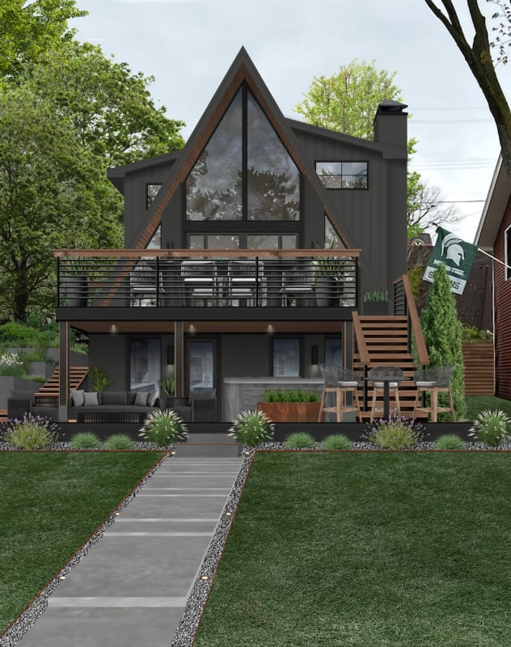

# Modern Styles Based on the Image



## Overview

The house in the image is a contemporary interpretation of **Modern A-Frame Architecture**, blending elements of **Modern Cabin / Nordic Modernism, Industrial Design, and Dark/Moody Contemporary Architecture**.

The major visual principles are:

* Steep vertical pitch (A-frame silhouette)

* High-contrast monochromatic palette (Matte black with warm timber)

* Soaring floor-to-ceiling gable glazing

* Multi-level outdoor deck integration

* Vertical line emphasis

* Industrial metal accents

* Symmetrical and geometric framing

* Integration into dense tree canopy/nature

* Defined linear pathway approach

The architecture gets much of its visual character from its
**dramatic vertical pitch, expansive triangular glass facade, moody dark vertical siding, and warm wood deck highlights**, rather than traditional ornamentation.

## 1. Modern A-Frame Architecture

The strongest classification for the home is **Modern A-Frame / Modern Alpine Cabin**.

Typical characteristics visible here include:

* Steeply angled roofline forming a sharp triangular peak

* Full-height triangular glass curtain wall maximizing views and light

* Elevated main deck expanding living space outdoors

* Multi-story vertical layout

* Matte dark siding (black/charcoal) juxtaposed with natural wood trim

* Symmetrical triangular geometry

* Seamless connection to a lush, wooded environment

The house leverages the iconic triangular silhouette to create dramatic indoor ceiling heights while channeling a modern retreat atmosphere.

### Key idea

> **Iconic triangular geometry reimagined with moody modern finishes and expansive glass.**

## 2. Nordic / Scandinavian Modernism (Dark Cabin Aesthetic)

The image contains strong influences of **Nordic Modernism (Hygge/Cabin Culture)**.

The style emphasizes:

* Minimalist, purposeful forms designed to withstand nature

* Connection to surrounding forest/woodland setting

* Deep dark exterior finishes (often charred wood / Shou Sugi Ban aesthetic)

* Warm wood accents on railings, soffits, and decking to soften dark tones

* Cozy multi-level outdoor living areas (fire pits, seating, patio)

The building communicates through a distinctive visual vocabulary:

> **Triangle + dark cladding + glass wall + warm wood deck**

This approach provides shelter and warmth while opening completely toward nature.

## 3. Industrial Modern Touches

The design reflects subtle principles of **Industrial Design**, particularly in its structural framing and metal detailing.

Key industrial elements visible include:

* Matte black horizontal cable/slat deck railings

* Exposed structural deck posts and steel supports

* Clean metal trim around windows and fascia

* Linear concrete stepping pavers bordered by dark stone gravel

* Crisp, functional outdoor furniture framing

The industrial elements add precision, durability, and modern edge to the cabin form.

## 4. Dark / Moody Contemporary Architecture

**Dark Exterior Architecture** gives this home its sleek, high-end contemporary appeal.

The facade is organized around:

* Uniform matte charcoal/black vertical panel siding

* Black window framing that blends into the facade

* Dark chimney structure anchoring the right elevation

* Recessed deck lighting creating dramatic evening accents

A useful description is:

> **Bold monochromatic darkness softened by natural timber and glass reflection.**

## 5. Multi-Level Outdoor Living Integration

The relationship between the home and its outdoor lawn area is designed around layered platforms.

The spatial progression flows seamlessly:

**Concrete Path → Lower Patio/Fire Lounge → Wooden Staircase → Upper Deck → Glazed Interior**

The decks double the functional footprint of the home, prioritizing outdoor entertaining and immersion in nature.

## 6. Vertical Emphasis & Soaring Proportions

Unlike horizontal ranch-style Modernism, this home has a **dramatic vertical orientation**.

The steeply pitched roof and vertical siding draw the eye directly upward.

This creates a feeling of:

* Elevation and grandeur

* Cathedral-like interior volume

* Shelter and protection

* Contrast against the flat green lawn in the foreground

The sharp peak cuts clean lines through the organic tree canopy behind it.

## 7. Geometric Symmetry & Framing

The building relies on strong, clear geometry:

* Prominent triangular gable frame

* Grid-divided glass wall sections

* Horizontal bands created by deck railings

* Straight-line concrete walkway approach

* Rectangular lower-level patio openings

> **A bold geometric shape set against soft, natural greenery.**

## 8. Materials

The image combines resilient industrial finishes with natural elements.

### Matte Black/Charcoal Siding

Creates a sleek, moody backdrop that helps the structure blend into tree shadows.

### Glass (Floor-to-Ceiling)

Reflects surrounding trees and floods the interior with natural light.

### Warm Timber / Wood Siding & Decking

Adds essential warmth, contrast, and tactile richness to railings, soffits, and steps.

### Matte Black Steel Railings

Provide safety without blocking line-of-sight views.

### Concrete Pavers & Gravel

Form a clean, structured pathway anchoring the lawn to the entrance.

The overall material strategy can be summarized as:

> **Dark cladding + soaring glass + warm timber + steel accents**

## 9. Monochromatic & Earthy Color Palette

The home uses a tightly controlled palette to maintain its modern edge:

* Charcoal / Matte Black (Dominant structure)

* Warm Honey / Walnut Wood (Accent trim, stairs, decking)

* Crisp Mirroring Glass (Reflects sky and trees)

* Slate Grey (Concrete pavers, stone patio)

* Forest Green (Lawn and background foliage)

This palette creates a grounded, luxurious, and architectural atmosphere.

## 10. Light & Transparency

Glass plays a central structural and visual role in this design.

The massive triangular window wall:

* Eliminates the visual barrier between the living room and canopy views

* Reflects daylight and foliage externally during the day

* Glows like a lantern at night, showcasing warm interior illumination

Light is used to make a dark, heavy shape feel weightless and open.

## 11. Forest-Integrated Landscaping

The landscape design grounds the dramatic vertical structure:

* Straight-line concrete path providing a strong visual axis to the house

* Symmetrical grass plantings bordering the lower deck

* Manicured lawn area providing an open foreground

* Dense woodland background framing the peak

This reinforces a secluded, retreat-like lifestyle.

## 12. Architectural Focal Points

The elevation features two dominant visual elements:

1. **The Peak:** The razor-sharp A-frame roofline with timber fascia trim.

2. **The Glass Wall:** The soaring triangular window array framing the upper deck.

Together, they create an unmistakable, iconic silhouette.

## 13. Modern A-Frame vs. Classic 1960s A-Frame

The image shows a modern evolution of the classic cabin typology.

### Classic 1960s A-Frame

Emphasized:

* Rustic wood shingles

* Smaller windows with thick wood frames

* Quaint, cozy, low-tech materials

* Exposed interior log rafters

### Modern Dark A-Frame

Emphasizes:

* Sleek black monochromatic finishes

* Precision-engineered glass walls

* Cable metal railings and integrated LED deck lighting

* Clean, linear pathway landscaping

This home updates a nostalgia-rich form into a **luxury modern sanctuary**.

## 14. Overall Style Classification

Style                          Relationship to Image

**Modern A-Frame / Alpine**    Very strong
**Nordic / Dark Cabin**        Strong
**Industrial Modern**          Moderate influence
**Contemporary Minimalist**    Moderate influence
**Mid-Century Modern**         Limited (historical root of A-frames)
**Traditional Architecture**   None

### Overall description

> **Modern Dark A-Frame residence combining Nordic cabin culture, soaring glazed gables, industrial metal accents, and layered outdoor deck integration.**

# Applying the Style to a Brand

If this image is used as brand inspiration for an athletic white-T-shirt company, its moody contrast, structural strength, and alpine-modern aesthetic can be translated into a visual identity.

## Colors

Use a deep, grounded palette:

* Pitch Black / Charcoal

* Deep Timber Brown / Warm Tan accent

* Concrete Slate Grey

* Alpine Forest Green

* Clean Optical White (as the hero contrast element)

The colors communicate resilience, shelter, premium quality, and focus.

## Typography

Use:

* Sharp, high-standing condensed sans-serif type (reflecting the vertical A-frame lines)

* Strong triangular / sharp-angled iconography

* Bold headline hierarchy

* High-contrast white lettering against dark backdrops

Avoid soft, rounded, or decorative script typefaces.

## Layout

Use:

* Strong vertical layout grids

* Full-bleed dark backgrounds with crisp white focal points

* Triangular or diagonal mask frames

* Layered deck-style content cards

* Centered, symmetrical path-like navigation axes

## Photography

Use:

* Moody, atmospheric lighting (early morning fog, golden hour, dusk glow)

* Deep shadow contrast with bright subject highlights

* Outdoor forest, alpine, or rugged mountain backdrop settings

* Sharp focus on garment durability, stitching, and fit against dark textures

## Graphic Elements

Use:

* Sharp apex / triangle icons ($\Delta$)

* Vertical rule lines and ladder-like slat details

* High-contrast split panels (Black vs. White)

* Subtle woodgrain or matte stone textures

# Applying Modernism to the Athletic T-Shirt Brand

The central idea could be:

> **Shelter, strength, and peak performance.**

The brand positions the white T-shirt as the ultimate, resilient core layer—clean and bright, protected within a rugged, dark, high-performance world.

### Product photography

Focus on:

* A bright white t-shirt glowing against a dark, moody forest or charcoal background

* High-contrast fabric close-ups showing heavy cotton weave or technical fiber density

* Fit and drape on athletic builds positioned against sharp architectural lines

### Packaging

Use:

* Matte black rigid box with warm timber-colored tape or accent seal

* Clean white t-shirt wrapped in crisp dark tissue paper

* Triangular branding stamp or embossed apex logo

### Website

A vertical, story-driven layout could showcase product engineering:

```
THE APEX WHITE TEE
PEAK PERFORMANCE & SHELTER

01 // STRUCTURE — Heavyweight 280GSM Fabric
02 // ELEVATION — Tailored Athletic Cut
03 // SHIELD — Weather-Resilient Fiber Blend
04 // BASE — Reinforced Flatlock Seams

```

### Brand phrasing

Instead of:

> "GREAT SHIRTS FOR OUTDOOR LIVING!"

Use:

> **"Built for the peak."**

> **"Grounded in strength. Elevated by design."**

> **"Your core layer against the elements."**

This connects the Modern Alpine visual language with the **Hero** and **Explorer** archetypes.

# Modernism + Hero

The sharp peak, dark armor-like exterior, and solid structural base strongly support the **Hero archetype**.

Modernism contributes:

> **Precision + Structure + Clarity**

The Hero contributes:

> **Resilience + Peak Performance + Endurance**

Together they create a brand personality that feels:

* Unshakable

* Elite

* Protective

* Focused

* Powerful

A possible brand philosophy is:

> **"Designed for tough conditions. Engineered to reach the peak."**

# Modernism + Explorer

The cabin-in-the-woods motif inherently connects with the **Explorer archetype**.

### Modernist + Hero

> **"Engineered for maximum endurance."**

Focus:

* Heavyweight fabric strength

* Structural integrity

* Protection and power

### Modernist + Explorer

> **"The ultimate base layer for any destination."**

Focus:

* Adaptability in nature

* Cabin/alpine lifestyle

* Freedom and sanctuary

# Key Takeaway

The image represents a modern style that values:

> **Verticality over flat orientation.**

> **Moody contrast over uniform brightness.**

> **Iconic geometric silhouette over complex ornamentation.**

> **Sanctuary and shelter integrated into nature.**

Its strongest architectural classification is **Modern Dark A-Frame**, supported by **Nordic Modernism, Industrial Detailing, and Contemporary Dark Architecture**.

For a brand, the takeaway is to leverage **bold vertical strength and dramatic contrast**:

> **Let a bright, clean core product shine against a bold, dark, and structured environment. Ground the visual identity in strength and elevation.**

For the athletic T-shirt brand, that philosophy becomes:

> **"Grounded strength. Peak performance."**

This creates a visual identity that feels **athletic, ruggedly premium, architectural, and ready for any environment**.
