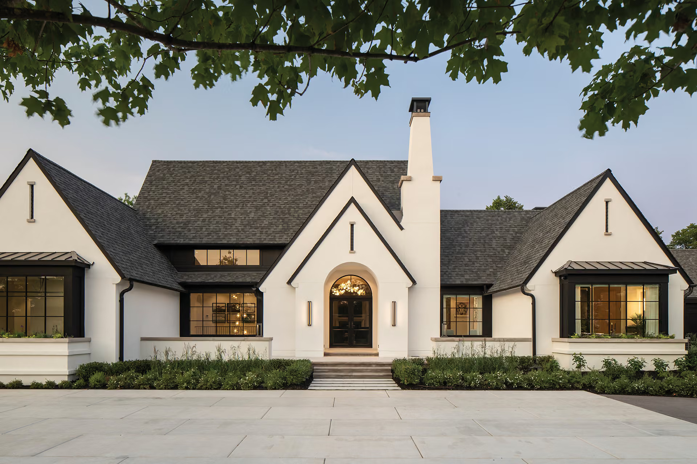

# Modern Styles Based on the Image



## Overview

The house in the image is a striking example of **Modern Tudor Revival**, blending elements of **Transitional Architecture, Modern Farmhouse, and Nordic Minimalist Luxury**.

The major visual principles are:

* Steeply pitched gables with crisp black fascia trim

* High-contrast stark white stucco facade paired with dark roofing

* Black steel-framed multi-pane windows (Crittall-style)

* Arched entryway portico defining the central axis

* Prominent vertical chimney feature

* Broad horizontal composition with balanced flanking wings

* Clean-lined stone-capped planter beds and expansive paved courtyard

* Subtle indoor warm lighting contrasting with cool exterior surfaces

The architecture gets much of its visual character from its
**dramatic gable geometry, ultra-clean monochrome contrast, crisp material detailing, and refined balance between traditional silhouettes and modern execution**, rather than ornamental historical masonry.

## 1. Modern Tudor Revival

The primary architectural classification for the house is **Modern Tudor Revival** (also referred to as Contemporary European Country or Modern Cottage).

Typical characteristics visible here include:

* Steep, prominent gables with sharply pointed rooflines

* Tall central accent chimney extending past the roofline

* Arched main entry doorway set within a gabled porch

* Multi-pane window grid patterns reminiscent of leaded glass windows

* Smooth light stucco walls replacing traditional half-timbering or heavy brickwork

* Narrow vertical slit accents in the upper gable peaks

The home simplifies historical Tudor forms into clean, graphic shapes while maintaining a sense of permanence and grandeur.

### Key idea

> **Classic European silhouette stripped of historical ornamentation and reinterpreted through crisp modern contrast.**

## 2. Transitional Architecture

The image also demonstrates the essence of **Transitional Architecture**—the bridge between traditional and contemporary design.

The style emphasizes:

* Familiar, timeless house shapes (pitched roof, chimney, archways)

* Minimalist modern execution (smooth surfaces, concealed gutters, crisp trim)

* Large contemporary window openings that maximize natural light

* Elimination of complex decorative moldings in favor of clean edges

The building speaks through a balanced architectural equation:

> **Classic Tudor silhouette + modern monochrome palette + ultra-clean materials**

This creates an aesthetic that feels both rooted in history and thoroughly contemporary.

## 3. Nordic / Scandinavian Luxury Minimalist Influence

The exterior reflects principles associated with **Scandinavian Luxury Architecture**, particularly in its stark color palette and disciplined execution.

Key characteristics include:

* High-contrast black-and-white color block palette

* Smooth, plaster-like white walls that capture natural ambient light

* Warm interior glow visible through glass openings contrasting cool exteriors

* Precise stone hardscaping and subtle, naturalistic greenery

* Absence of clutter, creating a calm and prestigious residential feel

The architecture relies on pristine craftsmanship rather than superficial decoration.

## 4. Modern Farmhouse Elements

While more refined than a standard barn-style home, the design shares common traits with **Modern Farmhouse** architecture.

Visual overlap includes:

* Stark black metal windows against bright white walls

* Dark standing-seam metal roof accents over window bays

* Broad, welcoming horizontal front footprint

* Simple, durable exterior surface materials

* Seamless integration of a wide, paved front motor court

A useful description is:

> **Refined estate elegance executed through modern farmhouse crispness.**

## 5. Symmetry & Axis-Driven Composition

The facade is organized around a strong **central entryway axis**.

The architectural hierarchy guides the eye naturally:

**Motor Court → Stone Steps → Framed Archway → Warm Entry Chandelier**

The central steep gable and chimney anchor the home, while asymmetrical left and right wings extend horizontally to add breadth without disrupting balance.

## 6. High-Contrast Monochromatic Palette

The color strategy is strictly disciplined and deliberate.

* **Pure White Stucco:** Reflects natural daylight, creating a luminous backdrop.

* **Matte Black Trim & Roof:** Outlines every architectural shape with graphic precision.

* **Warm Amber Interior Glow:** Softens the high-contrast shell and creates an inviting ambiance.

* **Natural Greenery:** Low-profile hedges and grass add a touch of organic softness along the foundation.

> **Light and shadow define the form, guided by bold black line work.**

## 7. Geometric Rhythm & Window Gridwork

The house utilizes repeating geometric motifs across its expansive facade:

* Triangular roof gables of varying scales

* Square and rectangular steel-framed window grids

* The repeating vertical lines of window mullions and chimney edges

* The single curving arch framing the front door

The black window mullions act as graphic grids that structure the light entering and exiting the home.

## 8. Materials

The facade is built from a luxurious palette of low-maintenance, high-impact materials.

### Smooth White Stucco / Render

Delivers a seamless, monolithic white surface that feels contemporary and clean.

### Dark Architectural Shingles & Metal Roofing

Provide texture on main roof slopes, with smooth standing-seam metal over bay projections.

### Black Steel/Aluminum Window Systems

Deliver thin profiles, maximum glass area, and crisp black lines.

### Smooth Limestone / Concrete Slabs

Cap the planter walls and form the grand, wide motor court pavers.

### Warm Wood & Metal Door Elements

Create a rich, tactile touchpoint at the central entryway.

The overall material strategy can be summarized as:

> **Monolithic white render + black metal framing + slate-toned roof + smooth stone paving**

## 9. Contemporary Hardscaping & Landscaping

The surrounding landscape is engineered to complement the building's geometry.

Key outdoor features include:

* Low, stone-capped retaining planters running parallel to the facade

* Native ornamental grasses and clipped low boxwoods providing neat green borders

* Expansive, large-format concrete paving slabs with clean grout lines

* Integrated soffit and wall sconce lighting accentuating vertical surfaces

The hardscaping creates a clean, uncluttered runway leading up to the architecture.

## 10. Architectural Focal Points

The elevation features three standout design elements:

1. **The Grand Entry Arch:** A deep-set, arched portico that draws you toward the front door.

2. **The Soaring Chimney:** A vertical white tower breaking up the horizontal roofline.

3. **The Layered Gables:** Three prominent triangular peaks creating a rhythmic, cascading skyline.

## 11. Traditional Tudor vs. Modern Tudor

The image provides a clear lesson in how historical styles are modernized.

### Traditional Tudor

Emphasized:

* Dark timber framing set into light plaster (half-timbering)

* Heavy textured brickwork and stone masonry

* Small diamond-pane windows

* Dark, heavy, and ornate interiors

### Modern Tudor

Emphasizes:

* Elimination of half-timbering in favor of smooth, solid surfaces

* Monochromatic black-and-white color schemes

* Large, expansive grid windows that maximize daylight

* Airy, light-filled interiors with high-end minimal finishes

This evolution turns a historically heavy aesthetic into a **bright, crisp, and prestigious modern estate style**.

## 12. Overall Style Classification

Style                          Relationship to Image

**Modern Tudor Revival**       Very strong
**Transitional Architecture**  Very strong
**Nordic Minimalist Luxury**    Strong
**Modern Farmhouse**           Moderate influence
**Contemporary Estate**        Strong
**Mid-Century Modern**         Limited
**Traditional Historical**     Moderate (silhouette only)

### Overall description

> **Modern Tudor Revival estate characterized by sharp white gables, black steel-framed grid windows, an arched entry portico, and refined transitional luxury finishes.**

# Applying the Style to a Brand

If this image is used as brand inspiration for an athletic white-T-shirt company, its high-contrast precision, timeless silhouette, and luxury minimal finish can be translated into a visual identity.

## Colors

Use a crisp, high-contrast, premium palette:

* Optical White (Dominant fabric and canvas tone)

* Pitch Black / Jet Black (Line work, typography, and trim accents)

* Warm Amber / Off-White (Secondary accent tone reflecting interior warmth)

* Cool Limestone Grey (Backgrounds and packaging texture)

The colors communicate purity, sharpness, structure, and elite quality.

## Typography

Use:

* Elegant, high-contrast serif or sharp geometric sans-serif typefaces

* Clean line spacing and refined kerning

* Balanced, centered headline compositions

* Crisp black type on pure white fields

Avoid distressed fonts or overly casual handwriting scripts.

## Layout

Use:

* Symmetrical and centered layout grids

* Generous white space framing product photography

* Strong black border lines framing content cards

* High-contrast visual splits (50/50 Black and White balance)

* Architectural proportions with clear hierarchy

## Photography

Use:

* Luminous, bright natural light with sharp directional shadows

* High-contrast product imagery featuring pure white tees on black backgrounds

* Clean architectural backgrounds (smooth plaster, concrete, dark metal framing)

* Sharp focus on fabric weave purity, collar structure, and clean seams

## Graphic Elements

Use:

* Thin black frame lines (inspired by steel window grids)

* Arch motifs for badges or logo marks

* Clean triangular accents mirroring gable peaks

* Minimalist iconography with sharp angles

# Applying Modernism to the Athletic T-Shirt Brand

The central idea could be:

> **Timeless form. Modern precision.**

The brand positions the white T-shirt as an essential, high-end classic—combining traditional garment heritage with modern athletic tailoring and crisp execution.

### Product photography

Focus on:

* A bright optical-white shirt set against clean, dark architectural lines

* Close-ups of the collar arch and reinforced shoulder seams

* Precision tailoring shown on athletic models in clean, modern architectural settings

### Packaging

Use:

* Crisp white rigid box with a sharp matte black border and minimal text

* Black tissue paper wrapping the pristine white shirt inside

* Embossed limestone-grey hangtag with black foil lettering

### Website

A clean, grid-structured layout could organize product highlights:

```
THE HERITAGE WHITE TEE
TRANSLATED FOR MODERN PERFORMANCE

01 // STRUCTURE — 100% Long-Staple Luxury Cotton
02 // TAILORING — Precision Architectural Fit
03 // COLLAR — Reinforced Arch-Knit Rib
04 // FINISH — Pre-shrunk Double-Stitched Hem

```

### Brand phrasing

Instead of:

> "LOOK GREAT IN A BASIC WHITE SHIRT!"

Use:

> **"The classic, perfected."**

> **"Precision in every line."**

> **"Timeless form. Uncompromising performance."**

This connects the Modern Tudor visual language with the **Ruler** and **Hero** archetypes.

# Modernism + Ruler

The grand scale, pristine symmetry, and commanding presence of the house strongly support the **Ruler archetype**.

Modernism contributes:

> **Clarity + Precision + Order**

The Ruler contributes:

> **Prestige + Excellence + Leadership**

Together they create a brand personality that feels:

* Elite

* Immaculate

* Uncompromising

* Established

* Authoritative

A possible brand philosophy is:

> **"Immaculate design. Superior craftsmanship."**

# Modernism + Hero

The sharp black-and-white contrast and disciplined execution also align with the **Hero archetype**.

### Modernist + Ruler

> **"The standard of excellence."**

Focus:

* Premium materials

* Flawless finish

* Prestige and status

### Modernist + Hero

> **"Built to hold its form."**

Focus:

* Structural durability

* Crisp shape retention

* Athletic discipline

# Key Takeaway

The image represents a modern style that values:

> **Clarity over complexity.**

> **High contrast over subtle blending.**

> **Timeless silhouette over short-lived trends.**

> **Precision craftsmanship over decorative flourish.**

Its strongest architectural classification is **Modern Tudor Revival**, supported by **Transitional Architecture and Nordic Minimalist Luxury**.

For a brand, the takeaway is to embrace **pristine contrast and structured elegance**:

> **Frame your product with sharp lines. Let pure white stand out boldly against deep black structure. Combine heritage silhouettes with modern athletic precision.**

For the athletic T-shirt brand, that philosophy becomes:

> **"Timeless form. Modern precision."**

This creates a visual identity that feels **immaculately clean, prestigious, structured, and timelessly modern**.
