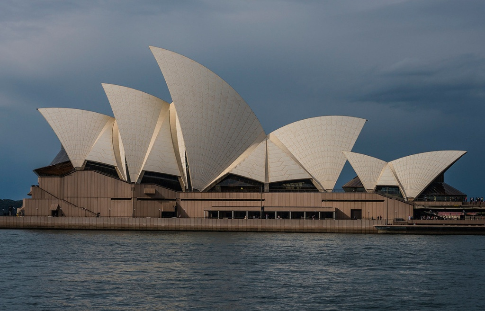

# Modern Styles Based on the Image



## Overview

The image features the world-renowned **Sydney Opera House**, designed by Jørn Utzon. It is a landmark masterwork of **Expressionist Architecture, Sculptural Modernism, and Organic Structuralism**.

The major visual principles are:

* Interlocking precast concrete shell vaults resembling sails or stylized shells

* High-contrast off-white Chevron-patterned ceramic tile skin against a dark, moody backdrop

* A heavy, monolithic granite podium anchoring the light, soaring roof structures

* Dynamic, sweeping radial geometries that convey forward motion and flight

* Geometric modularity derived from a single sphere's surface geometry

* Panoramic integration with surrounding water and dramatic natural elements

* Tinted bronze-framed glass walls suspended beneath the structural shells

The architecture derives its unforgettable identity from its
**dramatic sculptural silhouette, innovative engineered geometry, stark contrast between light roof and heavy base, and seamless fusion of natural inspiration with industrial precision**.

## 1. Expressionist Architecture (Late Modern Expressionism)

The primary architectural classification for the building is **Expressionist Architecture**, specifically Late Modernist Expressionism.

Typical characteristics visible here include:

* Non-rectilinear, sweeping form designed to evoke emotional resonance and wonder

* Sculptural, dynamic roof vaults that transcend purely utilitarian shape

* Dramatic, soaring peaks pointing upward and outward toward the harbor horizon

* Use of innovative structural engineering techniques to realize complex curves

* Visual rhythm created by repeated, cascading fan-like segments

The building breaks away from rigid boxy modernism to create a living, sculptural monument.

### Key idea

> **Pure architectural expression where structure itself becomes dramatic art.**

## 2. Structural Expressionism & Sculptural Modernism

The building is also a prime example of **Structural Expressionism**, where the visual aesthetics directly reveal the engineering and physics of the design.

The style emphasizes:

* Exposed precast concrete ribs supporting the inner vault roofs

* Modular shell geometry created from sections of a single theoretical sphere

* Visible seams and Chevron patterns in the ceramic tiles emphasizing radial lines

* Unapologetic structural honesty—no artificial decorative facades masking the form

The structure speaks through a balanced architectural equation:

> **Spherical mathematical geometry + precast concrete engineering + organic sail forms**

This creates an aesthetic that feels both mathematically precise and wildly organic.

## 3. Organic Architecture & Biomimicry Influence

Although constructed from heavy industrial materials, the design draws deep inspiration from nature and **Organic Architecture**.

Key characteristics include:

* Visual resemblance to billowing ship sails, sea shells, or opening palm fronds

* Fluid, aerodynamic profiles that respond to the coastal maritime environment

* Harmonic relationship with the surrounding body of water

* Natural rhythm in the repetition and layering of the shell segments

* Off-white ceramic skin that reflects changing sunlight and weather moods like natural shells

The structure feels grown from its harbor setting rather than merely placed upon it.

## 4. Monumental Podiums & Brutalist Foundation Roots

Supporting the soaring white roof shells is a massive, horizontal **earth-bound podium**.

Visual aspects include:

* Heavy, earth-toned precast granite cladding forming a solid terraced base

* Strong horizontal lines anchoring the lightweight, soaring vertical sails

* Broad grand staircases and massive stone terraces inviting public gathering

* A clear dichotomy between earth (dark, heavy podium) and sky (light, soaring sails)

A useful description is:

> **An indestructible stone pedestal giving birth to weightless architectural sails.**

## 5. Symmetry, Rhythm & Modular Geometry

While the overall footprint stretches dynamically across the point, each shell group is organized along a strict **radial axis**.

The architectural hierarchy guides the eye naturally:

**Heavy Stone Platform → Suspended Glass Curtains → Soaring Layered Shells → Skyward Points**

The shell series scales down sequentially, creating a musical rhythm across the skyline.

## 6. Dynamic High-Contrast Palette

The visual presence relies heavily on environmental contrast and tonal discipline.

* **Glossy & Matte White Ceramic Tiles:** Specially designed Swedish tiles that glisten in sunlight without glare.

* **Deep Granite Earth Tones:** Provide a grounded, stable counterweight at water level.

* **Dark Tinted Glass & Bronze Framework:** Recedes inward, making the white shells appear to float effortlessly.

* **Moody Maritime Background:** Dark clouds and deep water amplify the luminous purity of the white shells.

> **Light sails floating above dark stone, defined by crisp radial lines.**

## 7. Materials

The facade is constructed from an iconic, ultra-durable selection of materials.

### Swedish Ceramic Tiles (Höganäs Tiles)

Over one million self-cleaning tiles combining glazed and unglazed textures to catch light dynamically.

### Precast Concrete Ribbed Shells

Engineered concrete arches forming the structural spine of every vault.

### Pink-Brown Reconstituted Granite Slabs

Forming the massive, monolithic podium base that resists salt spray and weathering.

### Laminated Topaz-Tinted Glass

Suspended in custom steel and bronze mullions to enclose the halls while maintaining harbour views.

The overall material strategy can be summarized as:

> **Luminous ceramic skin + precast concrete ribs + massive granite base + deep tinted glass**

## 8. Traditional Rectilinear Modernism vs. Sculptural Expressionism

The image clearly illustrates the leap from standard modern boxes to sculptural landmarks.

### Rectilinear Modernism (International Style)

Emphasized:

* Flat roofs and right angles ($90^\circ$ geometry)

* Glass curtain walls with uniform steel grids

* Functional efficiency and industrial repetition

* Utilitarian, box-like massing

### Sculptural Expressionism

Emphasizes:

* Sweeping parabolic and spherical curves

* Dynamic, custom-engineered shell structures

* Organic, iconic shapes derived from nature and mathematics

* Art as architecture, turning the building into a national symbol

This evolution transforms utilitarian functionalism into an **unforgettable iconic gesture**.

## 9. Overall Style Classification

Style                          Relationship to Image

**Expressionist Architecture** Very strong
**Sculptural Modernism**       Very strong
**Structural Expressionism**    Very strong
**Organic Architecture**       Strong
**Monumental / Heroic**        Strong
**International Style**        Low (direct counter-reaction)

### Overall description

> **A masterwork of Expressionist and Sculptural Modernism, defined by soaring precast ceramic-tiled shells rising from a massive granite podium on the water’s edge.**

---

# Applying the Style to a Brand

If this iconic image is used as brand inspiration for an athletic white-T-shirt company, its dynamic energy, mathematical precision, and soaring sculptural form translate into a bold visual identity.

## Colors

Use a dramatic, high-contrast, elemental palette:

* **Sail White / Luminous Ceramic:** Primary white tee fabric tone with a subtle multidimensional weave.

* **Storm Grey / Deep Slate:** Backgrounds and dark contrast packaging, echoing dramatic coastal skies.

* **Granite Brown-Grey:** Grounded neutral tone for physical retail fixtures and hangtags.

* **Topaz Tint / Amber Glass:** Subtle secondary accent color for stitching details or digital highlights.

The colors communicate performance, luminous clarity, natural strength, and iconic stature.

## Typography

Use:

* Custom architectural sans-serif typefaces with geometric, sweeping curves

* High-contrast weights (ultra-light headers paired with heavy structural bold subheads)

* Dynamic, angled or arched typographic alignments reflecting shell curves

* Wide tracking for a spacious, atmospheric presentation

## Layout

Use:

* Layered, overlapping visual cards mimicking the cascading shell vaults

* Dynamic diagonal cuts and radial grid layouts instead of rigid squares

* High-contrast splits: dramatic dark backgrounds setting off brilliant white products

* Strong horizontal baselines (representing the podium) supporting soaring vertical images

## Photography

Use:

* Low-angle heroic shots looking up at athletic bodies in motion

* High-contrast lighting that emphasizes muscle contours and garment seam architecture

* Outdoor, dramatic sky and water settings contrasting against pristine white cotton

* Macro shots highlighting the geometric grid texture of the knit fabric

## Graphic Elements

Use:

* Sweeping parabolic line patterns inspired by concrete shell ribbing

* Chevron and triangular grid motifs reflecting the ceramic tile layout

* Layered arc badges and curved hem line indicators

* Minimalist structural diagrams showing garment pattern pieces

---

# Applying Expressionist Modernism to the Athletic T-Shirt Brand

The central idea could be:

> **Sculpted for motion. Engineered for form.**

The brand positions the white T-shirt not as a basic undershirt, but as an **icon of structural engineering and body-mapping design**.

### Product photography

Focus on:

* Pure white athletic tees captured mid-movement against dark, stormy maritime landscapes

* Dynamic close-ups of curved raglan sleeves and ergonomic shoulder panel seams

* Dimensional lighting capturing the texture and drape of the fabric like sculptural vaults

### Packaging

Use:

* Matte deep-slate rigid clamshell box with an embossed white chevron shell logo

* Layered tissue paper unfolding radially like the Opera House sails

* Heavy granite-textured cardstock tag with silver-foil structural specs

### Website

A dynamic, fluid-grid interface highlighting product features:

```
THE VAULT ATHLETIC TEE
ENGINEERED SCULPTURAL PERFORMANCE

01 // STRUCTURE — 3D Ergonomic Body-Mapping
02 // FABRIC — Luminous Chevron-Knit Breathable Cotton
03 // SEAMS — Pre-Curved Radial Ribbing for Motion
04 // BASE — Reinforced Monolithic Hemline
```

### Brand phrasing

Instead of:

> "COMFORTABLE ATHLETIC T-SHIRT FOR WORKOUTS."

Use:

> **"Iconic form in motion."**

> **"Engineered like no other."**

> **"Rise above the crowd."**

This connects the Expressionist Modernist visual language with the **Hero** and **Creator** archetypes.

---

# Modernism + Creator

The radical innovation, custom engineering, and artistic silhouette of the architecture strongly align with the **Creator archetype**.

Modernism contributes:

> **Precision + Innovation + Functionality**

The Creator contributes:

> **Visionary Design + Artistry + Originality**

Together they create a brand personality that feels:

* Visionary

* Sculptural

* Masterfully Crafted

* Innovative

* Uncompromisingly Unique

A possible brand philosophy is:

> **"Where engineering meets art."**

---

# Modernism + Hero

The soaring heights, storm-defying coastal presence, and athletic dynamism align with the **Hero archetype**.

### Modernist + Creator

> **"Architectural perfection in garment form."**

Focus:

* Pattern engineering

* Innovative fabric weaves

* Sculptural aesthetic silhouette

### Modernist + Hero

> **"Designed to conquer the elements."**

Focus:

* Unrestricted freedom of movement

* High-performance durability

* Heroic posture and silhouette reinforcement

---

# Key Takeaway

The image represents a modern style that values:

> **Sculptural expression over rigid boxes.**

> **Dynamic motion over static alignment.**

> **Integrated engineering over surface decoration.**

> **Iconic presence over subtle blending.**

Its strongest architectural classification is **Expressionist Architecture & Sculptural Modernism**.

For a brand, the takeaway is to embrace **heroic geometry and layered sculptural forms**:

> **Frame your product with dynamic angles and dramatic contrast. Let brilliant white form rise boldly against dark, grounded elements. Blend organic human movement with precise structural tailoring.**

For the athletic T-shirt brand, that philosophy becomes:

> **"Sculpted for motion. Engineered for form."**

This creates a visual identity that feels **visionary, heroic, structurally superior, and timelessly iconic**.
