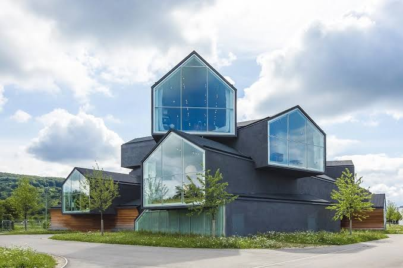

# Modern Styles Based on the Image



## Overview

The structure in the image (the VitraHaus designed by Herzog & de Meuron) is an iconic masterwork of **Deconstructivist Architecture, Archetypal Deconstruction, and Contemporary Nordic Brutalism**.

The major visual principles are:

* Stacked, intersecting gabled house profiles cantilevered at dramatic angles

* Charcoal black / dark slate monolithic exterior cladding

* Full-height, floor-to-ceiling glass gable ends offering total visual transparency

* Sculptural rotation of individual modules creating dynamic overhangs and shadows

* Seamless integration of natural timber bases with dark charcoal stucco/plaster surfaces

* Clean, borderless edge profiles with concealed gutters and trimless window frames

* Minimal landscape context allowing the bold geometric composition to stand out

The architecture derives its striking character from its
**playful stack of traditional house silhouettes, bold monochromatic weight, dramatic cantilevers, and radical transparency at the terminal points**.

## 1. Archetypal Deconstruction / Contemporary Deconstructivism

The primary architectural classification for this structure is **Deconstructivist Architecture**, specifically playing with the archetypal "house" form.

Typical characteristics visible here include:

* Disassembly and reassembly of the traditional pitched-roof house shape

* Multi-directional orientation with modules pointing toward different horizon views

* Complex internal intersections where pitched shapes slice through one another

* Gravity-defying cantilevers extending outward over the base landscape

* Elimination of traditional facade rules in favor of dynamic volumetric stacking

The building redefines domestic familiarity into an extraordinary, monumental sculpture.

### Key idea

> **The universal house silhouette taken apart, multiplied, and stacked into a gravity-defying dynamic structure.**

## 2. Neo-Minimalist Monolithic Design

Despite its complex geometry, the building adheres to strict **Minimalist discipline** in its surface treatments and color application.

The style emphasizes:

* Unified, unbroken charcoal-black exterior skin across walls and roof slopes

* Frameless glass end-caps acting as pure windows into interior spaces

* Concealed drainage systems that preserve the razor-sharp profile edges

* Monolithic material choices that accentuate shadow and silhouette over surface ornament

The building operates on a clear visual equation:

> **Archetypal pitched gable + charcoal monochrome skin + panoramic glass end-caps**

This creates a high-impact aesthetic that is simultaneously playful and intensely sophisticated.

## 3. Nordic Modernism & Contemporary Alpine Fusion

The design heavily references **Nordic/Alpine architectural traditions**, updated with modern structural engineering.

Key characteristics include:

* Steeply pitched roof lines built to shed snow and frame vertical views

* Warm wood cladding integrated into ground-level base zones

* Unobstructed connection to surrounding greenery and distant mountain hills

* Deep interior illumination contrasting against dark, protective exterior shells

* Natural material harmony (wood, glass, dark stone/stucco)

The structure feels like a clustered mountain village elevated into a single landmark facility.

## 4. Volumetric Stacking & Spatial Intersection

The structural composition relies on **intersecting geometric masses** rather than a single unified shell.

Visual aspects include:

* Five distinct horizontal levels formed by stacked individual house units

* Dramatic overhangs providing natural weather shading for lower levels

* Structural steel inner framing allowing large open floor plans with zero interior columns at the glass tips

* Ever-changing perspective from every angle as you move around the building

A useful description is:

> **A controlled collision of modern house forms layered in 3D space.**

## 5. Symmetry, Rotation & Dynamic Axis

Unlike traditional symmetrical buildings, this design uses **rotational asymmetry**.

The architectural hierarchy guides the eye naturally:

**Grounded Timber Base → Dark Cantilevered Modules → Frameless Glass Terminals → Interior Warmth**

Each module points along a unique visual axis, capturing specific vistas of the surrounding landscape.

## 6. High-Contrast Monochromatic Palette

The color strategy relies on bold contrast between dark exterior mass and light interior spaces.

* **Charcoal / Matte Black:** Gives the stacked volumes weight, definition, and graphic clarity.

* **Ultra-Clear Architectural Glass:** Opens the ends of each module, rendering the structure weightless from key angles.

* **Natural Timber Accents:** Ground the base of the structure with warm, organic texture.

* **Luminous Interior Lights:** Display internal activity like illuminated gallery boxes against the night sky.

> **Dark geometric shells containing brilliant, light-filled spaces within.**

## 7. Materials

The exterior uses an ultra-refined, minimal material palette designed to let geometry take center stage.

### Dark Charcoal Stucco / Mineral Render

A continuous, matte dark skin covering both vertical walls and sloped roofs.

### Structural Glass Curtains

Minimalist, heat-treated glass panels spanning the entire gable cross-section.

### Warm Slat Wood Base Panels

Natural wooden cladding framing the entry and ground-level foundation.

### Hidden Steel Structure

Internal steel trusses enabling extreme cantilevered spans without visible exterior supports.

The material strategy can be summarized as:

> **Matte charcoal skin + frameless glass ends + warm wooden foundation**

## 8. Traditional House Form vs. Stacked Deconstructivism

The image highlights how a basic, universal shape can be radically reinterpreted.

### Traditional House Form

Emphasized:

* Grounded, single-volume placement

* Standard punch-hole windows in solid walls

* Symmetrical, predictable layout

* Horizontal street orientation

### Stacked Deconstructivism

Emphasizes:

* Multi-directional 3D cantilevering

* Walls replaced entirely by glass at gable ends

* Asymmetrical, intersecting volumetric layout

* Vertical stacking expanding upward into the sky

This evolution converts a simple domestic icon into an **architectural spectacle**.

## 9. Overall Style Classification

Style                          Relationship to Image

**Deconstructivism**            Very strong
**Neo-Minimalism**              Very strong
**Nordic Contemporary**        Strong
**Modular Architecture**        Strong
**Brutalism (Modern Dark)**     Moderate
**Traditional Domestic**       Moderate (archetype source only)

### Overall description

> **A deconstructivist masterpiece featuring stacked, cantilevered house modules wrapped in charcoal render with panoramic glass gables.**

# Applying the Style to a Brand

If this image is used as brand inspiration for an athletic white-T-shirt company, its bold structural layering, charcoal monochrome intensity, and radical transparency translate into a powerful visual identity.

## Colors

Use a sharp, modern, atmospheric palette:

* **Matte Charcoal / Jet Black:** Dominant background color representing structure and mystery.

* **Crisp Optical White:** Primary shirt fabric color, popping against dark backgrounds like illuminated interiors through glass.

* **Raw Timber Oak:** Subtle warm neutral tone for hangtags and retail wood accents.

* **Clear Sky Slate:** Secondary accent grey for tech specs and line graphics.

The colors communicate structural strength, precision engineering, high contrast, and premium design.

## Typography

Use:

* Sharp, technical sans-serif fonts (e.g., DIN-inspired or modern geometric sans)

* Monospaced structural callouts for technical specifications

* Clean, centered, or modular grid layouts for editorial headers

* High-contrast white text on dark charcoal fields

## Layout

Use:

* Modular card-stack layouts overlapping diagonally across the screen

* Full-bleed imagery with sharp structural line breaks

* Dynamic grid systems featuring offset product cards mimicking cantilevers

* Clean geometric borders and framing boxes

## Photography

Use:

* High-contrast editorial lighting: stark dark backgrounds with bright key light on white tees

* Dynamic low-angle shots emphasizing athletic shoulders and tapered hem lines

* Architectural background settings featuring dark concrete, matte black metal, and clean glass

* Macro close-ups showing the precise knit pattern and seam structure

## Graphic Elements

Use:

* Intersecting house/gable vector line icons for badges

* Modular structural gridlines showing garment pattern construction

* Clean triangular and isometric diagrams

* High-contrast split panels (50/50 Charcoal and White)

# Applying Stacked Modernism to the Athletic T-Shirt Brand

The central idea could be:

> **Stacked for performance. Form re-engineered.**

The brand positions the white T-shirt as a **modular masterpiece of garment engineering**—built layer by layer with precision fit, ultimate durability, and modern structural shape.

### Product photography

Focus on:

* Folded and stacked white tees forming sharp geometric angles against charcoal backgrounds

* Athletic models captured in dynamic, angular poses framed by bold architectural shadows

* Extreme close-ups of pristine collar gables and seam junctions

### Packaging

Use:

* Matte charcoal rigid box with a slide-out inner drawer

* Embossed geometric house-gable logo in gloss black foil

* Crisp white tissue paper shielding the shirt inside like a glass-encased display

### Website

A modern, modular interface showcasing garment architecture:

```
THE STACKED ATHLETIC TEE
RE-ENGINEERED FROM THE GROUND UP

01 // STRUCTURE — 3D Ergonomic Modular Fit
02 // SHELL — Heavyweight 240 GSM Organic Cotton
03 // JOINTS — Reinforced Double-Needle Seams
04 // PROFILE — Angular Tapered Silhouette

```

### Brand phrasing

Instead of:

> "GREAT FITTING ATHLETIC SHIRT."

Use:

> **"Form re-engineered."**

> **"Precision in every layer."**

> **"Stand out from every angle."**

This connects the Deconstructivist visual language with the **Creator** and **Architect/Ruler** archetypes.

# Modernism + Creator

The radical reimagining of traditional shapes and complex volumetric layering strongly support the **Creator archetype**.

Modernism contributes:

> **Structure + Precision + Clarity**

The Creator contributes:

> **Innovation + Radical Design + Originality**

Together they create a brand personality that feels:

* Visionary

* Structural

* Highly Engineered

* Unconventional

* Boldly Modern

A possible brand philosophy is:

> **"Deconstructing the ordinary. Building the extraordinary."**

# Modernism + Hero

The massive charcoal weight, dramatic overhangs, and confident posture align with the **Hero archetype**.

### Modernist + Creator

> **"Architectural precision in athletic wear."**

Focus:

* Advanced pattern design

* Modular garment engineering

* Distinctive visual silhouette

### Modernist + Hero

> **"Built to hold its form under pressure."**

Focus:

* Structural shape retention

* Heavyweight fabric durability

* Athletic stance enhancement

# Key Takeaway

The image represents a modern style that values:

> **Radical form over conventional shape.**

> **Monolithic color over busy multi-tone patterns.**

> **Structural transparency over closed facades.**

> **Dynamic rotation over static alignment.**

Its strongest architectural classification is **Deconstructivist Architecture & Neo-Minimalism**.

For a brand, the takeaway is to embrace **bold modular structure and dramatic contrast**:

> **Frame your product with sharp geometric angles. Let pure white stand out boldly against deep charcoal surfaces. Re-engineer classic wardrobe staples through visionary design.**

For the athletic T-shirt brand, that philosophy becomes:

> **"Stacked for performance. Form re-engineered."**

This creates a visual identity that feels **innovative, structurally superior, visually commanding, and uncompromisingly modern**.
